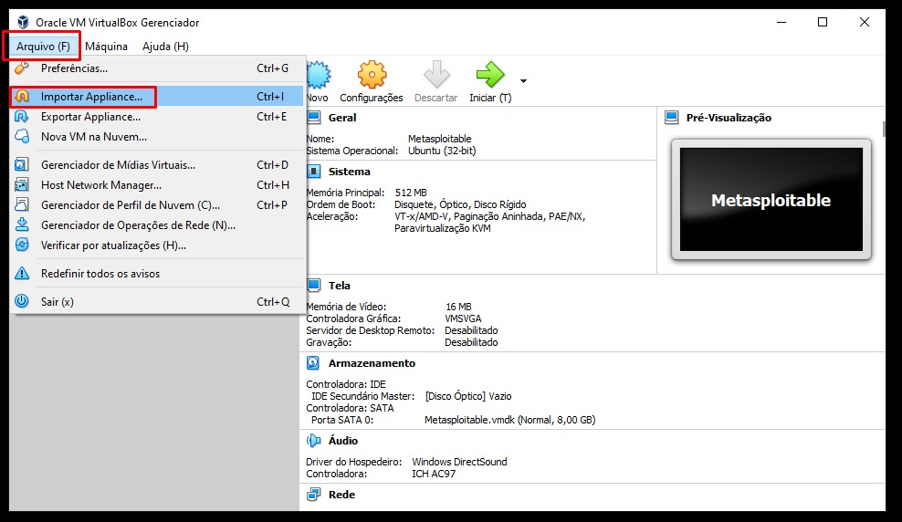
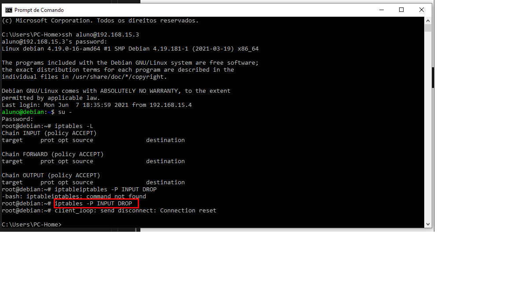

# Segurança da informação
## Configurando Firewall via Terminal e acessando/bloqueando acesso

Trabalharemos com VM's no Virtual Box

Obs: a distro Debian já está pré configurada pelo prof. (usuario, chave ssh)

1- importe a distro para Virtual Box

Agora faça o clone

Obs: o clone servirá para tarefas posteriores

2- Agora configura a rede da máquina principal no V. Box

Agora selecione a maquina que deseja iniciar, após selecionar, uma das formas de iniciar é clicando na seta verde iniciar
 

Após iniciar a máquina informe o login e senha

Consulte o IP através do comando ip -4 a

Agora com o IP da minha rede interna, posso acessar usuario Aluno com servidor de ssh previamente instalado

Para isso utilizarei o prompt de comado (CMD)

Agora invoque o super usuário através do comando Su - 

Agora liste as regras existentes através do cmando iptables -L 

Mudando a politica padrão do INPUT através do comando iptables -P INPUT DROP 

Xi perdi acesso! isso porque travei o input por ter infligido regra da política padrão. 

Listando a política vigente (iptables -L)

iptables -F muda as regras para a politica padrão

Agora vou tentar mudar a politica padrão través do comando iptables -F que limpa as regras "Flush" retornando para política padrão e em seguida enviando o comando iptables -L para listar novamente os dados da tabela 

Notou que nada foi modificado? isso porque a listagem anterior já é a política padrão 

Portanto para que possa mudar as regras da política padrão use o comando iptables -P INPUT ACCEPT (aceitando input)

em seguida liste os dados da tabela com o comando:  iptables -L

Note na imagem a seguir que agora tenho acesso ssh aluno@... liberado

Agora logar como root novamente e efetuar o comando  (iptables -A INPUT -m state --state ESTABLISHED,RELATED -j ACCEPT) com esse comando o Firewall aceitará todas as conexões validas já estabelecidas 

Agora vou "Dropar a conexão" com o comando iptables -P INPUT DROP e vou listar a tabela com o comando iptables -L com isso mudei minha política para drop e não perdi a conexão

Agora que a conexão esta "Dropada" conforme aponta a seta 02, vou tentar acesso! através do Powershell
Note que reportou time out, isso porque havia acabado de bloquear acesso através do comando DROP
Agora vou liberar o acesso INPUT para o IP da minha máquina que reponde no IP 192.168.15.4 conforme destacado na figura abaixo

O acesso será permitido conforme as especificações da seta 03 da imagem abaixo, e para que isso aconteça utilizarei o comando iptables -A INPUT -p tcp -s 192.168.15.4 -i enp03 --drop 22 -j ACCEPT 

iptables -L para listar

Confirmando a liberação de acesso no Powershell

Agora posso novamente deletar a regra que permitia o acesso, através do comando iptables -D INPUT 2

Note que reportará time out

<!---->

Agora vamos subir uma nova interface, a interface enp0s8 

Para isso utilizaremos o editor de texto Unix VI, que deverá ser aberto no caminho para interfaces: vi /etc/network/interfaces

Informe os dados da nova interface, conforme destacado

após isso tecle: "esc" depois ":" depois "wq", para salvar e sair do editor 

Agora é só "rebootar" a maquina e verificar se a nova interface foi criada

Agora consulte as interfaces existentes através do comando ip -4 a

note que agora temos a interface enp0s8

Com privilégio su - adicionarei um novo IP (192.168.0.16/24)

<!-- -->

Poderia apenas ter modificado o IP 10.0.1.10/24, portanto farei a exclusão do mesmo utilizando o comando ip addr del 10.0.1.10/24 dev enp0s8

Note que na nova consulta o IP 10.0.1.10/24 já não existe

Agora vou configurar para que qualquer máquina ou dispositivo que esteja na minha rede local possa acessar o ssh da máquina virtual

Obs: apenas configurar por enquanto, sendo que o acesso só será possível após configuar outros parametros que farei mais a diante (NAT e tals) 

<!-- 
A rede 192.168.0.0/24 acesse a porta 22 da rede 10.0.1.0/24
 -->

Configurar para que a rede 192.168.15.4/24 acesse porta 22 da rede 192.168.0.16/24

Para fazer sentido vou "dropar" a cadeia FORWARD com o comando iptables -P FORWARD DROP

Agora sim vou liberar acesso para qualquer dispositivo da rede local, vou usar o comando iptables -A FORWARD -p tcp -s 192.168.0.0/24 -d 192.168.0.16/24 --dport 22 -j ACCEPT

